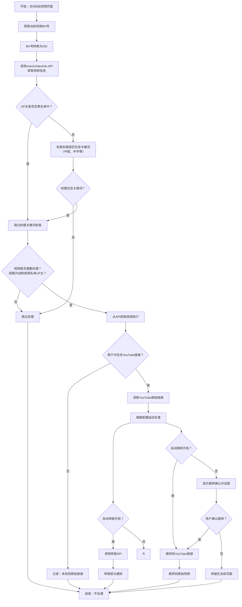

# B站中配视频跳转与举报助手

## 功能简介
本脚本用于自动检测B站中的AI中配视频，并提供跳转到原视频的功能和以及自动举报功能。

## 程序逻辑流程图

## 核心功能说明

### 1. 视频检测逻辑
- **黑名单UP主检测**：优先检查UP主UID是否在用户配置的黑名单中
- **标题关键词检测**：对于非黑名单UP主，检查视频标题是否包含配置的关键词（如"中配"、"中字"）
- **原创状态检测**：视频必须是原创作品（copyright=1）或来自黑名单UP主才会被处理

### 2. 链接提取
- 从视频简介中提取YouTube原始链接
- 支持多种YouTube链接格式（youtube.com/watch?v= 和 youtu.be/）

### 3. 处理动作
- **自动举报**：可配置是否自动举报检测到的AI中配视频
- **自动跳转**：可配置是否自动跳转到原始视频
- **手动确认**：未开启自动跳转时，会显示确认对话框

### 4. UID黑名单管理
- **从GitHub加载**：黑名单从项目的`blacklist_uid.json`文件自动加载
- **手动重新加载**：通过"从GitHub加载UID黑名单"菜单项手动更新黑名单
- **查看当前黑名单**：通过"查看当前UID黑名单"菜单项查看已加载的UID列表
- 黑名单UP主的视频会跳过标题关键词检查

## 安装步骤
1. 确保已安装 [Tampermonkey](https://www.tampermonkey.net/) 扩展（支持 Chrome、Firefox、Edge 等浏览器）。
2. 点击以下链接安装脚本：
   - [安装脚本](https://github.com/LuoRogers/bilibili_jump_and_report_helper/raw/refs/heads/master/bilibili_jump_and_report_helper.user.js)
3. 安装完成后，刷新B站视频页面即可使用。

## 使用方法
- **自动跳转**：在脚本设置中开启自动跳转功能，检测到中配视频后会自动跳转到原视频链接。
- **自动举报**：开启自动举报功能后，脚本会自动举报检测到的中配视频。
- **手动操作**：通过 Tampermonkey 菜单手动选择跳转或举报。
- **UID黑名单管理**：脚本启动时自动从GitHub加载黑名单，也可通过菜单手动重新加载。

## 配置选项
通过Tampermonkey菜单可以配置以下选项：
- 关键词列表（默认：中配、中字）
- 延迟时间（默认：1500ms）
- 自动跳转开关
- 自动举报开关
- 举报描述模板
- UID黑名单：从GitHub加载和查看

## 版本历史
- v3.3：修改UID黑名单管理方式，改为从GitHub加载，删除本地管理功能
- v3.2：新增UID黑名单检查功能，优化检测逻辑
- v3.1：初始版本，支持标题关键词检测和YouTube链接提取
