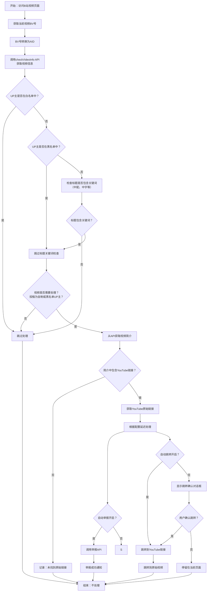

# B站中配视频跳转与举报助手

 > 本项目的代码由 [Vibe Coding](https://cline.bot/) 辅助生成

## 功能简介
本脚本用于自动检测B站中的AI中配视频，并提供跳转到原视频的功能和以及自动举报功能。


## 安装步骤
1. 确保已安装 [Tampermonkey](https://www.tampermonkey.net/) 扩展（支持 Chrome、Firefox、Edge 等浏览器）。
2. 点击以下链接安装脚本：
   - [安装脚本](https://github.com/LuoRogers/bilibili_jump_and_report_helper/raw/refs/heads/master/bilibili_jump_and_report_helper.user.js)
3. 安装完成后，刷新B站视频页面即可使用。
4. 
## 程序逻辑流程图



## 核心功能说明

### 1. 视频检测逻辑
- **白名单优先检查**：首先检查UP主UID是否在用户本地白名单中，如果在则跳过所有处理
- **黑名单UP主检测**：检查UP主UID是否在从GitHub加载的黑名单中
- **标题关键词检测**：对于非黑名单UP主，检查视频标题是否包含配置的关键词（如"中配"、"中字"）
- **原创状态检测**：视频必须是原创作品（copyright=1）或来自黑名单UP主才会被处理

### 2. 链接提取
- 从视频简介中提取YouTube原始链接
- 支持多种YouTube链接格式（youtube.com/watch?v= 和 youtu.be/）

### 3. 处理动作
- **自动举报**：可配置是否自动举报检测到的AI中配视频
- **自动跳转**：可配置是否自动跳转到原始视频
- **手动确认**：未开启自动跳转时，会显示确认对话框

### 4. UID黑名单管理
- **从GitHub加载**：黑名单从项目的`blacklist_uid.json`文件自动加载
- **黑名单格式**：支持对象数组格式 `[{"uid": 1263732318, "name": "黑纹白斑马", "remark": ""}, ...]`
- **查看完整黑名单**：显示UP主的UID、名称和备注信息
- **向后兼容**：也支持简单的UID数组格式
- 黑名单UP主的视频会跳过标题关键词检查

### 5. UID白名单管理
- **本地存储**：白名单存储在用户本地，使用Tampermonkey的GM_setValue/GM_getValue
- **添加当前UP主**：将当前视频的UP主添加到白名单
- **删除当前UP主**：从白名单中删除当前视频的UP主
- **删除指定UID**：手动输入UID从白名单中删除
- **清空白名单**：一键清空所有白名单记录
- **查看白名单**：查看当前所有白名单UID

## 使用方法
- **自动跳转**：在脚本设置中开启自动跳转功能，检测到中配视频后会自动跳转到原视频链接。
- **自动举报**：开启自动举报功能后，脚本会自动举报检测到的中配视频。
- **手动操作**：通过 Tampermonkey 菜单手动选择跳转或举报。
- **黑名单管理**：脚本启动时自动从GitHub加载黑名单，也可通过菜单手动重新加载和查看。
- **白名单管理**：通过"黑名单/白名单管理"菜单进行完整的白名单管理。

## 配置选项
通过Tampermonkey菜单可以配置以下选项：
- 关键词列表（默认：中配）
- 延迟时间（默认：1500ms）
- 自动跳转开关
- 自动举报开关
- 举报描述模板
- 黑名单/白名单管理：
  - 从GitHub加载UID黑名单
  - 查看当前UID黑名单（显示完整信息）
  - 查看当前UID白名单
  - 添加当前UP主到白名单
  - 从白名单中删除当前UP主
  - 从白名单中删除指定UID
  - 清空白名单

## 版本历史
- v3.3：支持新的黑名单格式（对象数组），添加完整的白名单管理功能
- v3.2：修改UID黑名单管理方式，改为从GitHub加载，删除本地管理功能
- v3.1：新增UID黑名单检查功能，优化检测逻辑
- v3.0：初始版本，支持标题关键词检测和YouTube链接提取

## 黑名单格式说明
最新的黑名单使用对象数组格式，每个对象包含以下字段：
```json
[
  {
    "uid": 1263732318,
    "name": "黑纹白斑马",
    "remark": ""
  },
  {
    "uid": 56628194,
    "name": "AI译片君",
    "remark": ""
  }
]
```
脚本同时支持向后兼容，可以处理简单的UID数组格式。

